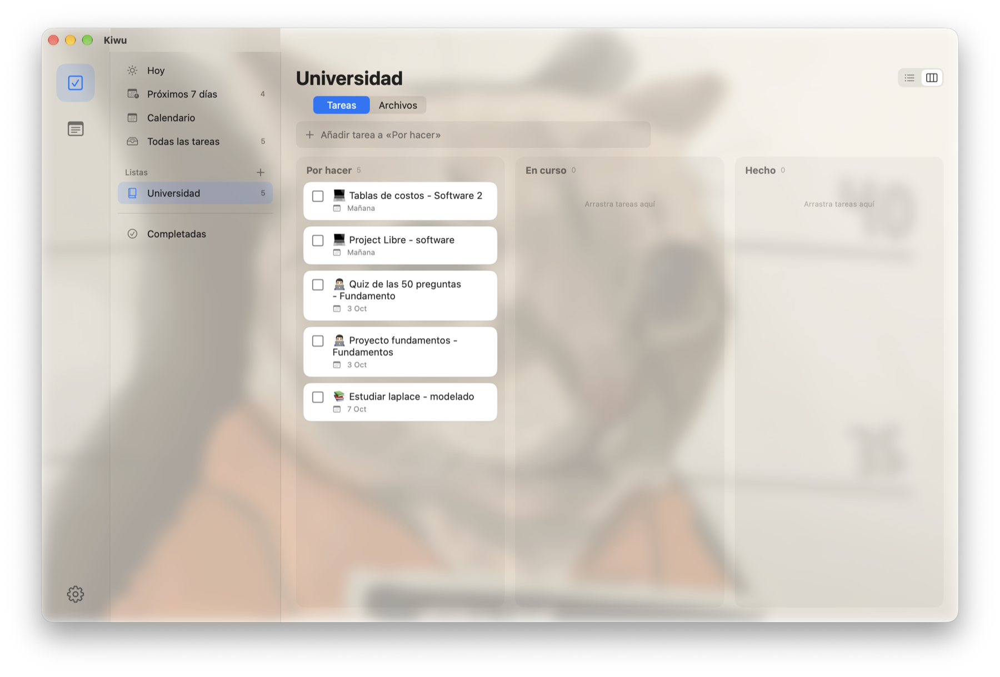
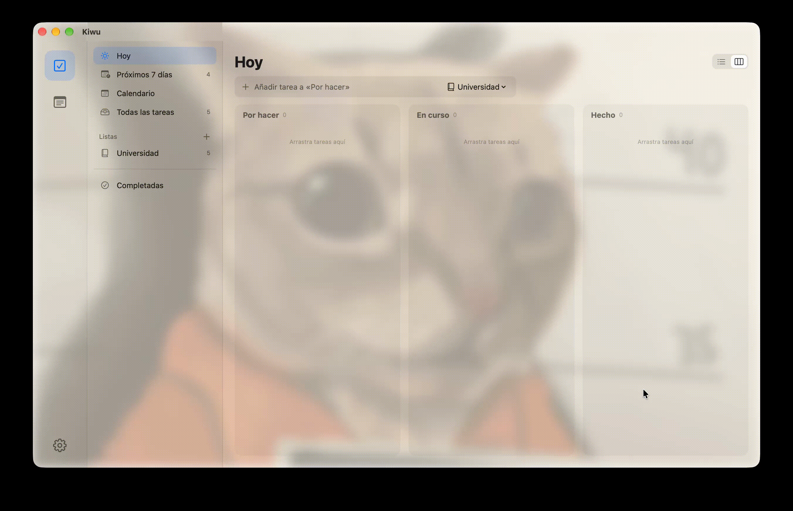
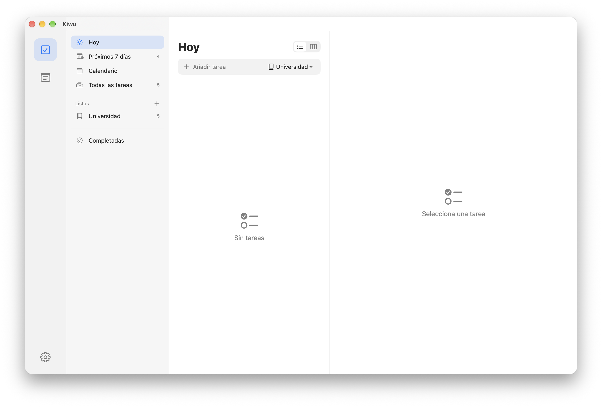
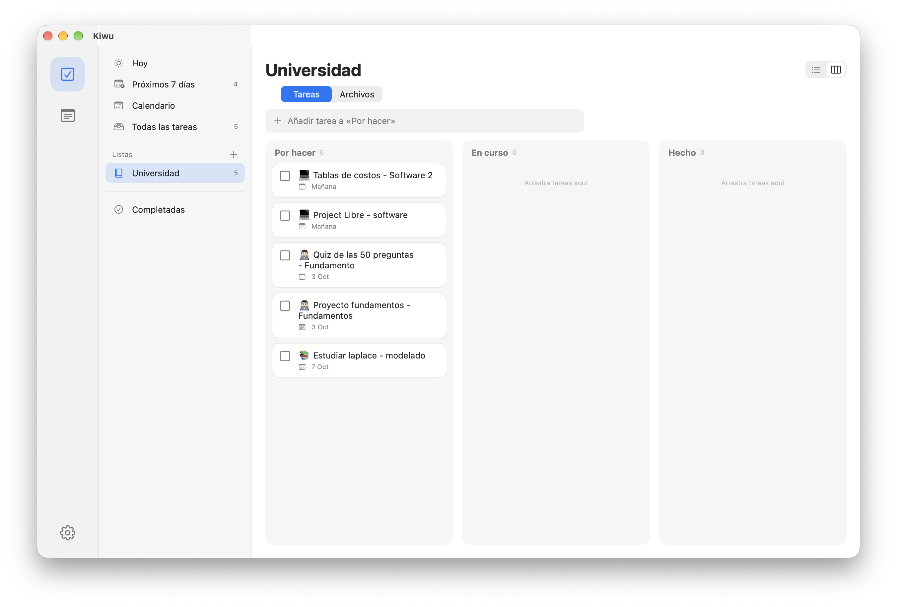
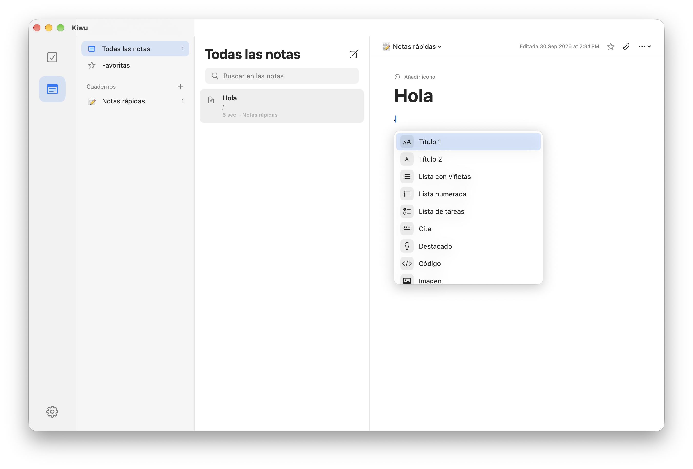
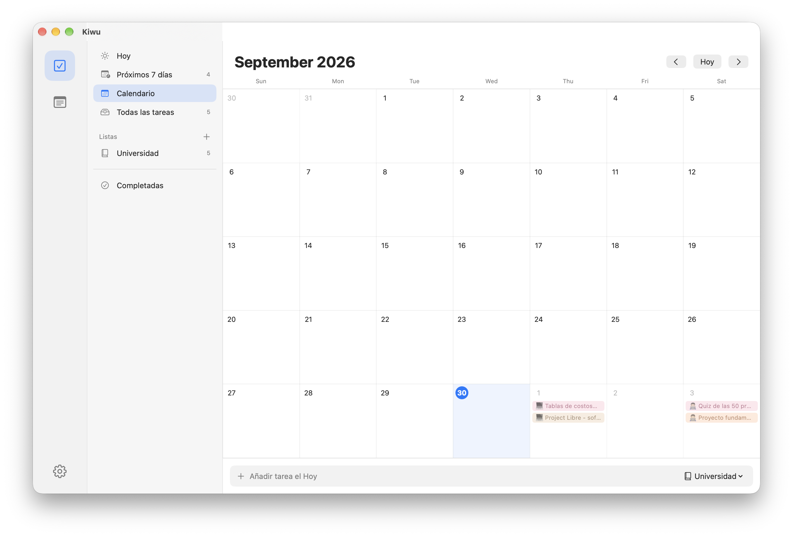
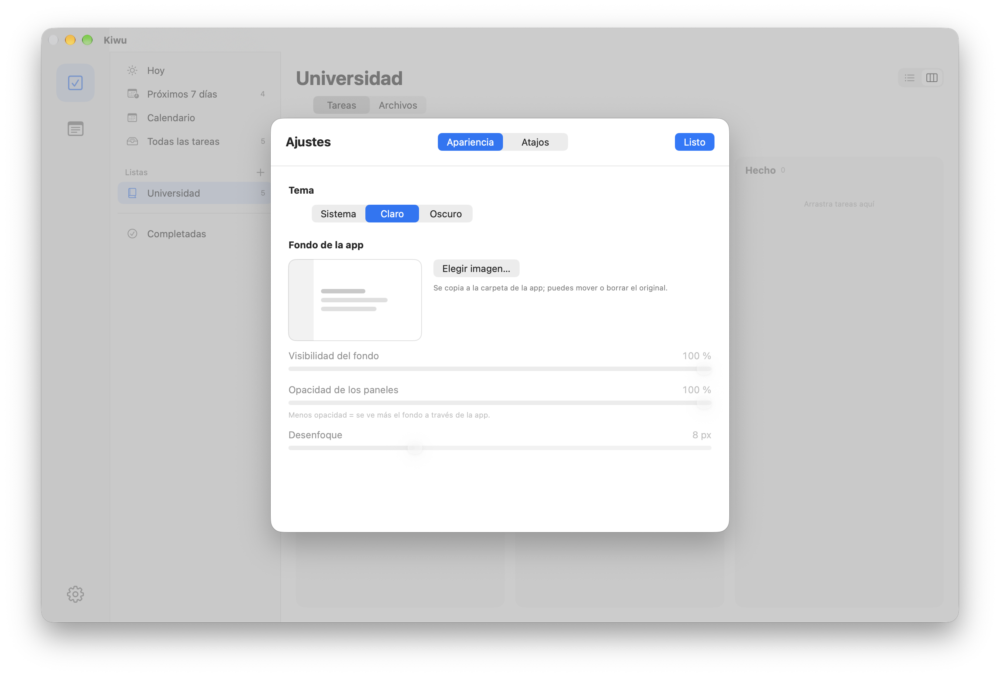
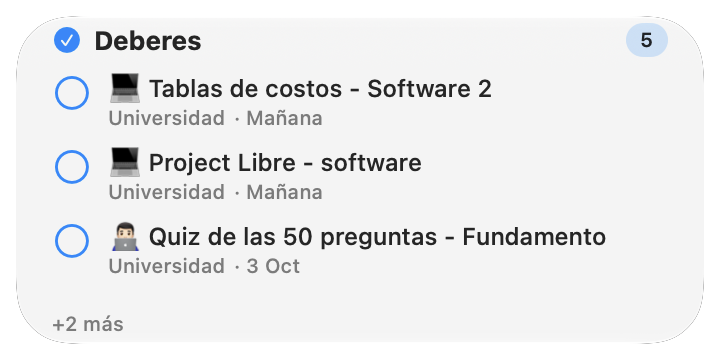
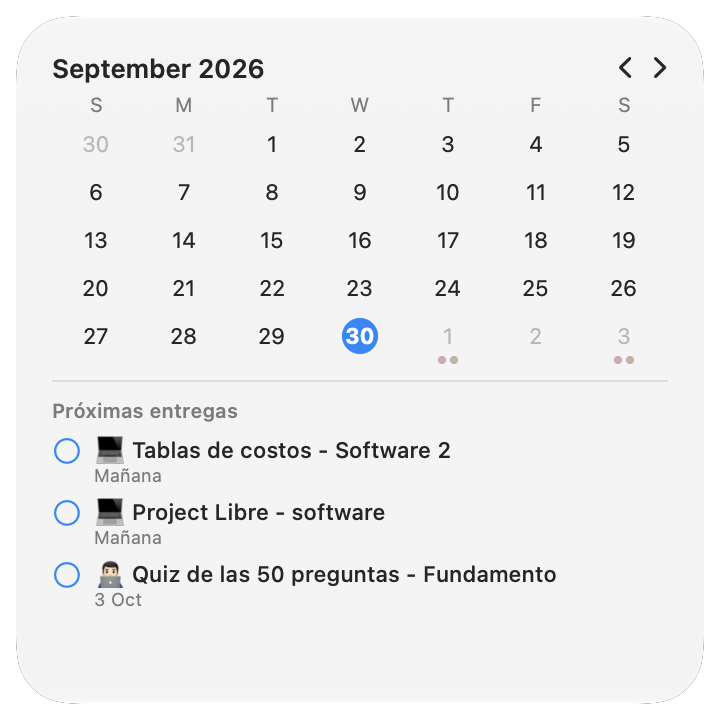

<p align="center">
  
</p>

<h1 align="center">Kiwu</h1>

<p align="center">
  <b>Tareas, tablero, calendario y notas para macOS y Linux.</b><br>
  Todo en tu equipo: sin cuentas, sin nube, sin publicidad.
</p>

<p align="center">
  <a href="https://github.com/ksebas20500/kiwu/releases/latest/download/Kiwu.dmg"><b>⬇️ Descargar para macOS</b></a>
  &nbsp;·&nbsp;
  <a href="#linux"><b>🐧 Instalar en Linux</b></a>
  &nbsp;·&nbsp;
  <a href="https://github.com/ksebas20500/kiwu/releases">Todas las versiones</a>
</p>

<p align="center">
  <a href="https://github.com/ksebas20500/kiwu/releases/latest"></a>
  
  
  
  
  <a href="LICENSE"></a>
</p>

<p align="center">
  
</p>

<p align="center">
  
</p>

> Creado por **Kevin Sebastián Medina Nava**. Antes se llamaba *TaskFlow*; si vienes de la versión 1 de macOS, mira [Actualizar desde TaskFlow](macos/README.md#actualizar-desde-taskflow-versión-1x).

## Descargas e instalación

Cada sistema tiene su propio instalador y su propia numeración de versiones (más detalles en [docs/publicar-versiones.md](docs/publicar-versiones.md)). Puedes instalar de **dos formas**: con un comando en la terminal o descargando el archivo y haciéndolo a mano.

| Sistema | Archivo para instalar a mano | Más información |
| --- | --- | --- |
| 🍎 **macOS** 13 o superior | [`Kiwu.dmg`](https://github.com/ksebas20500/kiwu/releases/latest/download/Kiwu.dmg) (universal: Apple Silicon e Intel) | [macos/README.md](macos/README.md) |
| 🐧 **Linux** (Arch + Hyprland / Wayland) | `kiwu-linux.tar.gz`, en los [releases `linux-v…`](https://github.com/ksebas20500/kiwu/releases?q=linux-v) | [linux/README.md](linux/README.md) |

Descarga la última versión desde [Releases](https://github.com/ksebas20500/kiwu/releases/latest). Cada versión conserva su propio archivo en la [lista de versiones](https://github.com/ksebas20500/kiwu/releases).

### 🍎 macOS

**Opción 1: un solo comando** (recomendada; comprueba la descarga y deja la app lista para abrir)

```bash
curl -fsSL https://raw.githubusercontent.com/ksebas20500/kiwu/main/install.sh | bash
```

El mismo comando sirve en cualquier sistema: detecta macOS o Linux y ejecuta el instalador que le corresponde.

**Opción 2: a mano.** Descarga `Kiwu.dmg`, ábrelo y arrastra **Kiwu** a *Aplicaciones*.
La primera vez, macOS avisará de que no puede verificar al desarrollador (la app no está notarizada por Apple, porque eso requiere una cuenta de pago). Para abrirla:

- *Ajustes del Sistema → Privacidad y seguridad → Abrir igualmente*, o
- en la Terminal: `xattr -dr com.apple.quarantine /Applications/Kiwu.app`

El instalador es **universal** (Apple Silicon e Intel), pesa unos pocos MB y necesita macOS 13 o superior (widgets: macOS 14 o superior).

Si prefieres no fiarte de un binario, compílalo tú mismo o revisa cómo se genera en [`macos/Tools/crear-instalador.sh`](macos/Tools/crear-instalador.sh).

### 🐧 Linux

Necesitas `python-gobject`, `gtk4`, `libadwaita` y `gtksourceview5` (en Arch: `sudo pacman -S python python-gobject gtk4 libadwaita gtksourceview5`).

**Opción 1: un solo comando** (recomendada; comprueba la descarga, instala en tu carpeta personal sin `sudo` y crea la entrada en el menú de aplicaciones)

```bash
curl -fsSL https://raw.githubusercontent.com/ksebas20500/kiwu/main/install.sh | bash
```

**Opción 2: a mano.** Descarga `kiwu-linux.tar.gz` de [Releases](https://github.com/ksebas20500/kiwu/releases?q=linux-v), descomprímelo y ejecuta su instalador:

```bash
tar -xzf kiwu-linux.tar.gz
cd kiwu-linux-*
./install.sh
```

También puedes comprobar antes la descarga con el archivo `kiwu-linux.tar.gz.sha256` (`sha256sum -c kiwu-linux.tar.gz.sha256`). Para desinstalar: `./install.sh --desinstalar` (no borra tus datos). En Arch también puedes usar el `PKGBUILD`; los detalles, la configuración de Hyprland y las opciones del instalador están en [linux/README.md](linux/README.md).

## Capturas

| | |
| --- | --- |
|  |  |
| **Lista** · vistas Hoy, Próximos 7 días y por materia | **Tablero** · Por hacer, En curso y Hecho, con arrastrar y soltar |
|  |  |
| **Notas** · editor por bloques con menú `/`, formato, código con colores y enlaces con vista previa | **Calendario** · tus entregas del mes |
|  | |
| **Ajustes** · tema, atajos editables y fondo translúcido | |

**Widgets de escritorio**

| | |
| --- | --- |
|  |  |
| **Deberes** · se completan desde el widget | **Calendario de deberes** · el mes y las próximas entregas |


## Qué incluye

| Módulo | Qué ofrece |
| --- | --- |
| **Tareas** | Listas por materia, deberes con fecha y hora, recordatorios locales, vistas *Hoy* / *Próximos 7 días* / *Todas* / *Completadas*, en **lista o tablero** (Por hacer · En curso · Hecho) |
| **Calendario** | Mes completo con las entregas en colores pastel; el día se expande con doble clic |
| **Notas** | Cuadernos, páginas con emoji, favoritas, búsqueda y editor por bloques con menú `/` |
| **Archivos** | Carpeta de tu equipo vinculada a cada lista con explorador integrado, y PDF/Word adjuntos a notas como referencia, sin duplicarlos |
| **Ajustes** | Atajos de teclado editables, tema claro/oscuro y fondo de imagen con translucidez ajustable |
| **Widgets** (solo macOS) | *Deberes*, *Nota rápida* y *Calendario de deberes*, configurables y con acciones directas |
| **Privacidad** | Todo local: sin cuentas, sin servidor, sin publicidad ni analíticas |

**macOS:** SwiftUI · Core Data · WidgetKit (macOS 13 o superior; widgets en macOS 14+).
**Linux:** Python · GTK4 · libadwaita · SQLite (sin widgets por ahora).

## Tecnologías

| | 🍎 macOS | 🐧 Linux |
| --- | --- | --- |
| **Lenguaje** | Swift | Python 3 |
| **Interfaz** | SwiftUI (con AppKit para el editor de texto) | GTK4 + libadwaita (PyGObject), nativa en Wayland |
| **Datos** | Core Data (SQLite) | SQLite |
| **Editor de notas** | `NSTextView` con texto enriquecido | `GtkTextView` con etiquetas de formato |
| **Código con colores** | Resaltador propio (colores de VS Code Dark+/Light+) | GtkSourceView 5 con temas Dark+/Light+ |
| **Vídeos incrustados** | WebKit (`WKWebView`) | WebKitGTK 6 (opcional) |
| **Recordatorios** | UserNotifications | Notificaciones del escritorio (GNotification / D-Bus) |
| **Widgets** | WidgetKit + App Intents + App Groups | — (no incluidos por ahora) |
| **Atajos globales** | Menús de la app | Órdenes `kiwu --nueva-tarea` enlazadas en Hyprland (Wayland no permite capturar teclas globales) |
| **Instalador** | `.dmg` universal (Apple Silicon e Intel) | `.tar.gz` con instalador, `PKGBUILD` y metadatos AppStream |
| **Pruebas** | — | Python `unittest`: lógica, instaladores y prueba de humo de la interfaz |

Los dos comparten el **formato de las notas** (JSON con bloques y formato) y el mismo diseño; los datos de macOS se pueden importar en Linux.

## Privacidad

No hay servidor, cuentas, publicidad ni analíticas. La app solo se conecta a Internet cuando pegas un enlace en una nota, para descargar su vista previa (título, descripción e imagen) o reproducir un vídeo de YouTube/Vimeo; nunca envía tus datos. Los datos viven en el almacenamiento local de la app; los widgets leen una copia de los deberes y notas recientes desde un App Group del propio sistema.

## Estructura del repositorio

```
kiwu/
  README.md        Esta página
  LICENSE          Licencia MIT (común)
  install.sh       Instalador por terminal que elige el de tu sistema
  docs/            Documentación y capturas comunes
  macos/           App de macOS (SwiftUI) con su propio instalador (.dmg)
  linux/           App de Linux (GTK4 + libadwaita) con su propio instalador
```

Cada carpeta de plataforma es independiente: tiene su código, sus pruebas, su instalador y su documentación.

## Contribuir

Las ideas, los errores y las mejoras son bienvenidos: abre un *issue* o un *pull request*. Indica la plataforma (macOS o Linux) en el título. Antes de enviar cambios, comprueba que compilan o pasan las pruebas de la plataforma que tocas (ver su README) y que no incluyes datos personales, como tu Team ID.

## Autor y créditos

- **Autor y mantenedor:** Kevin Sebastián Medina Nava.
- Diseño de la interfaz, logo y widgets creados para este proyecto.
- Desarrollado con la ayuda de [Claude Code](https://claude.com/claude-code) (Anthropic) como asistente de programación.
- Gracias a quienes reporten errores, propongan ideas o envíen mejoras.

## Licencia

Copyright © 2026 Kevin Sebastián Medina Nava. Distribuido bajo la licencia [MIT](LICENSE).
